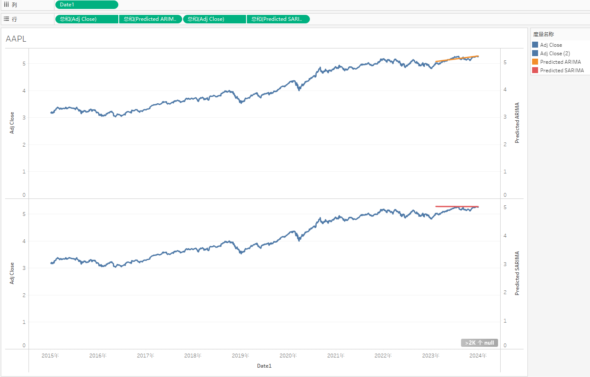
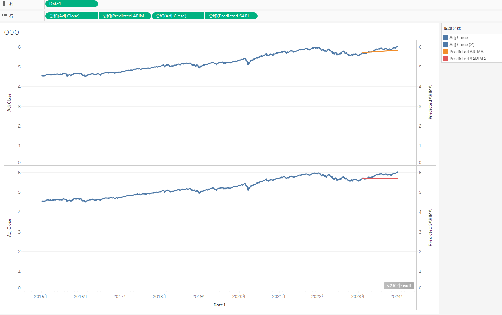
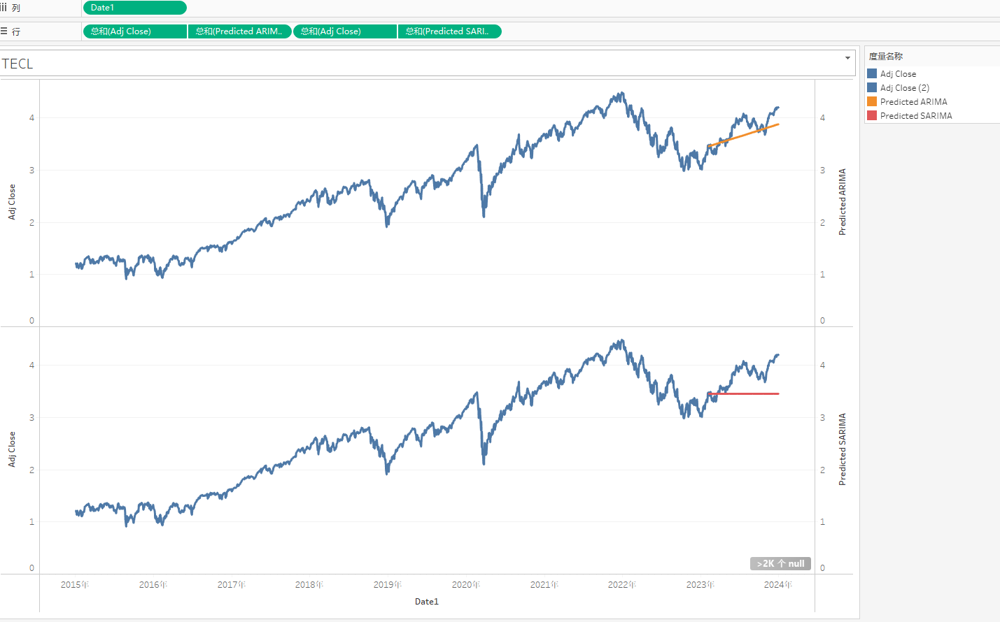

# Stock Price Prediction

**Authors:**  
- **Yingqi Pei** (pyingqi18@vt.edu)  
- **Zhen Zhang** (zhenz@vt.edu)  

## Project’s Function
The project aims to design a machine learning model to predict future trends of specific stocks using historical data. By analyzing past performance, it helps investors make informed trading decisions, optimizing buying and selling strategies for better investment outcomes.

## Dataset
We are utilizing historical stock data from the Yahoo Finance API (2015-2024), focusing on QQQ, TECL, and AAPL. Key attributes include date, open, close, high, low prices, adjusted close, and trading volume. The data is ingested in batches and stored in an Amazon S3 data lake for preprocessing and analysis. Predictions are based on the adjusted close price (`adj close`) from 2015-2023 to forecast 2024 trends.

## Pipeline / Architecture
- **Data Collection:** Batch ingestion via Yahoo Finance API into Amazon S3. Initial data acquisition was performed, storing the raw data as `data.pkl`.
- **Preprocessing:** 
  - Conducted EDA to assess trends, stationarity, and outliers.
  - Applied **log transformations** to stabilize variance.
  - Removed outliers using the **1.5 IQR method**.
  - Performed **first-order differencing** and **lag-12 differencing** to stabilize trends and remove seasonality.
  - Improved missing value handling by using **time-based interpolation** instead of linear methods.
  - Automatically optimized model hyperparameters by **fitting the best parameters** using `pmdarima`.
  - Cleaned data was stored as `clean_aapl.pkl`, `clean_qqq.pkl`, and `clean_tecl.pkl`.
- **Storage:** Transformed data saved in Amazon S3 for efficient access and later moved to MySQL for visualization.
- **Modeling:** 
  - **ARIMA:** Applied for general time-series forecasting to capture trends and dependencies.
  - **SARIMA:** Used for seasonal adjustments, specifically set with a monthly seasonality parameter (**m=12**) to account for annual patterns in stock movements.
  - Modeling process leveraging the clean data to generate `arima_predictions.pkl` and `sarima_predictions.pkl`.
- **Validation:** Used the first 9 years of data (2015-2023) for training and the last year (2024) for validation.
- **Visualization:** Generated using Tableau, combining predictions and real stock prices (adjusted close) for a clear representation of model performance.

## Data Quality Assessment
The dataset is of high quality, sourced from Yahoo Finance, a trusted provider of historical stock data. Rigorous cleaning processes were applied, including log transformations, outlier removal, and handling missing values with time-based interpolation. The quality was reassessed through exploratory data analysis (EDA) to ensure stationarity and validate the processed data.

## Data Transformation and Provenance
### Data Transformation
- **Transformations Applied:**
  - Log transformations to stabilize variance.
  - 1.5 IQR method to remove outliers.
  - First-order differencing and seasonal differencing (lag-12) for seasonality removal.
  - Time-based interpolation to handle missing data.

### Data Provenance
- **Data Source:** Yahoo Finance API, version **finance==0.2.40**.
- **Time Period:** 2015-2024 for stocks QQQ, TECL, and AAPL.
- **Process Timeline and Responsibilities:**
  - **Acquisition (10/23/2024):** Raw data retrieval and storage in Amazon S3 as `data.pkl`  
    **Responsible:** Zhen Zhang  
  - **Transformation (10/25-10/31/2024):**  
    - **EDA before preprocessing (10/25-10/27):** Trends, outliers, and stationarity visualization  
      **Responsible:** Yingqi Pei  
    - **Cleaning and preprocessing (10/27-10/29):** Log transformations, outlier removal, and smoothing. Processed data saved as `clean_aapl.pkl`, `clean_qqq.pkl`, and `clean_tecl.pkl`.  
      **Responsible:** Zhen Zhang, Yingqi Pei  
    - **EDA after preprocessing (10/30-10/31):** Stationarity re-check and ACF/PACF feature analysis.  
      **Responsible:** Yingqi Pei  
  - **Modeling (11/1-12/1/2024):**  
    ARIMA and SARIMA modeling, storing predictions in `arima_predictions.pkl` and `sarima_predictions.pkl`.  
    **Responsible:** Yingqi Pei  
  - **Storage (12/3/2024):** Cleaned and transformed data stored in MySQL for Tableau visualization.  
    **Responsible:** Zhen Zhang  
  - **Visualization (12/3/2024):** Tableau dashboards for performance visualization.  
    **Responsible:** Yingqi Pei  

- **Validation:** Data cross-validated with NASDAQ official API for reliability and consistency.

## Data Transformation and Models
- **Transformations:** Log transformations, first-order differencing, and seasonal differencing for stability.
- **Feature Engineering:** Moving averages and autoregressive features to enhance model fitting.
- **Models Used:** 
  - **ARIMA:** A time-series forecasting model well-suited for capturing trends and dependencies in stock price data. ARIMA was particularly effective in predicting the general price movements for stocks like AAPL, demonstrating its strength in straightforward trend forecasting.
  - **SARIMA:** An extended version of ARIMA that includes seasonal adjustments (e.g., lag-12 differencing for monthly seasonality). However, SARIMA struggled to provide meaningful improvements in accuracy, likely due to the limited seasonal patterns in the stock data and the increased complexity of the model.
- **Expected Results:** Reliable predictions for short-term and long-term trends, with a pipeline ready for near real-time forecasts.

## Infographic
1. **Pipeline Architecture:**   

2. **Results Visualization:** 
### AAPL

### QQQ
 

### TECL

<!-- **TODO: Pei - Insert visualization HERE** -->

## Code
The complete codebase can be found at the following GitHub repository: [GitHub Repository Link](https://github.com/nikmomo/Stock-Market-Prediction)

## Thorough Investigation
- **Viability:** The project demonstrates strong potential for scaling by integrating more diverse datasets or extending to other financial instruments. Its robust provenance tracking ensures data integrity and reproducibility.
- **Innovativeness:** Combining seasonal adjustments (SARIMA) with an automated pipeline represents a novel approach to time-series stock forecasting.
- **Challenges:** Computational costs during data transformation and the need to balance model complexity with interpretability remain key challenges.
- **Next Steps:** Transition to machine learning-based models like LSTMs and Transformers, explore multi-stock correlations, and incorporate alternative data sources (e.g., news sentiment) for richer predictions. Final deployment would include real-time trading assistance using the enhanced model.

## Conclusion
The ARIMA model proved to be effective for predicting stock price trends, particularly excelling in capturing the overall movement of AAPL's stock prices. Its simplicity and ability to model non-seasonal data trends make it a strong choice for straightforward time-series forecasting. In contrast, the SARIMA model underperformed, likely due to the lack of pronounced seasonal patterns in the data and the added complexity of the model. This highlights the importance of matching model complexity with the characteristics of the dataset to achieve optimal results.
