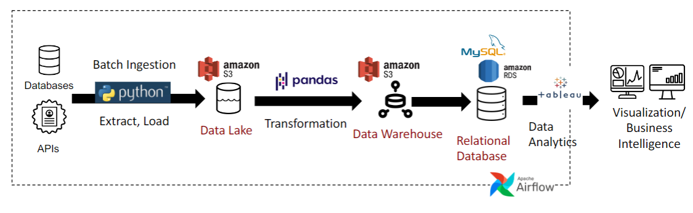

# Stock Price Prediction

## Project’s Function
The project aims to design a machine learning model to predict future trends of specific stocks using historical data. By analyzing past performance, it helps investors make informed trading decisions, optimizing buying and selling strategies for better investment outcomes.

## Dataset
We are utilizing historical stock data from the Yahoo Finance API (2015-2024), focusing on QQQ, TECL, and AAPL. Key attributes include date, open, close, high, low prices, adjusted close, and trading volume. The data is ingested in batches and stored in an Amazon S3 data lake for preprocessing and analysis.

## Pipeline / Architecture
- **Data Collection:** Batch ingestion via Yahoo Finance API into Amazon S3.
- **Preprocessing:** 
  - Applied **log transformations** to stabilize variance.
  - Removed outliers using the **1.5 IQR method**.
  - Performed **first-order differencing** for trend stabilization.
  - Improved missing value handling by using **time-based interpolation** instead of linear methods.
  - Automatically optimized model hyperparameters by **fitting the best parameters** during preprocessing.
  - Conducted feature engineering including moving averages (MA) and autoregressive (AR) features for enhanced model fitting.
- **Storage:** Transformed data saved in Amazon S3 for efficient access.
- **Modeling:** 
  - **ARIMA:** Applied for general time-series forecasting to capture trends and dependencies in the stock data.
  - **SARIMA:** Used for seasonal adjustments, specifically set with a monthly seasonality parameter (**m=12**) to account for annual patterns in stock movements.
- **Validation:** Used the first 9 years of data (2015-2023) for training and the last year (2024) for validation.
- **Visualization:** Line charts for trends, scatter plots for correlations, and bar charts for key metrics.

## Data Quality Assessment
The dataset is of high quality, containing comprehensive stock attributes over nearly a decade. Quality was assessed through missing value handling, outlier detection/removal, and transformation steps such as log-smoothing and differencing to stabilize variance and mean.

## Data Transformation and Models
- **Transformations:** Log transformations, first-order differencing, and seasonal differencing for stability.
- **Feature Engineering:** Calculated moving averages and autoregressive features.
- **Models Used:** 
  - **ARIMA:** General forecasting for trends and dependencies.
  - **SARIMA:** Seasonal pattern modeling with **m=12**.
- **Expected Results:** Robust predictions for both short-term and long-term trends, automated pipeline for near real-time forecasts.

## Infographic
1. **Pipeline Architecture:**   

2. **Results Visualization:** 

<!-- **TODO: Pei - Insert visualization HERE** -->

## Code
The complete codebase can be found at the following GitHub repository: [GitHub Repository Link](https://github.com/nikmomo/Stock-Market-Prediction)

## Thorough Investigation
- **Viability:** The project demonstrates strong potential for scaling by integrating more diverse datasets or extending to other financial instruments. The current use of ARIMA and SARIMA models lays a solid foundation for further exploration of advanced modeling techniques.
- **Innovativeness:** The implementation of a seasonal adjustment approach combined with an automated data pipeline showcases innovation in handling time-series data. This structured pipeline enables streamlined updates and efficient model management.
- **Challenges:** Challenges encountered include the computational costs associated with large-scale data preprocessing and ensuring the consistency and reliability of the data pipeline.
- **Next Steps:** Future work will focus on transitioning to machine learning-based models, such as LSTMs or Transformers, for enhanced forecasting accuracy. Additionally, the integration of multi-stock correlations and alternative data sources, such as news sentiment analysis, will be explored to improve predictive capabilities. The ultimate goal is to deploy the enhanced model as a real-time trading assistant to support dynamic decision-making.